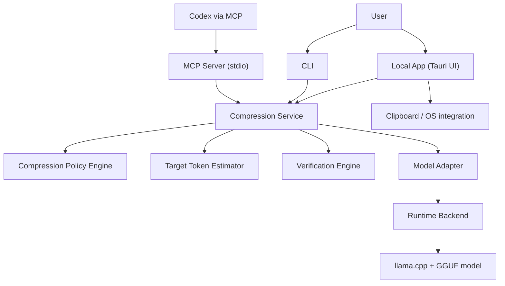
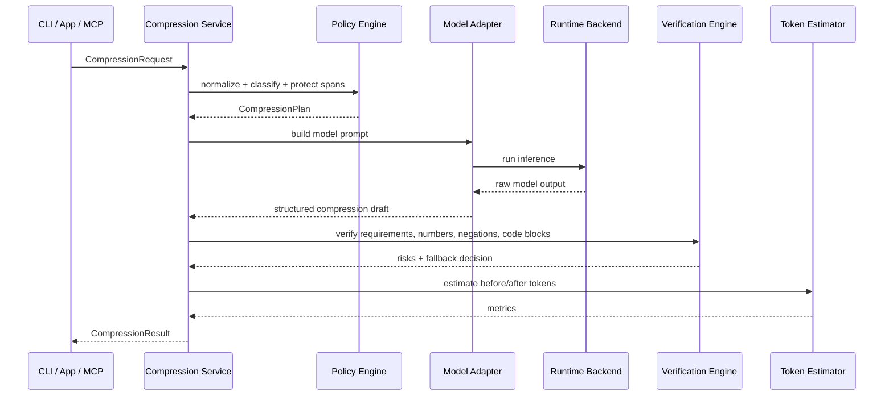

# ローカルLLMプロンプトリレー 設計 v0.1

要件定義: `企画資料\要件定義_ローカルプロンプト圧縮.md` v0.8 を元にした初期設計。

この文書の目的は、MVP実装に入れる粒度まで責務、構成、入出力、失敗時の挙動を具体化すること。

## 1. 設計対象

この設計で扱う範囲:

- Core圧縮エンジン
- CLI
- `stdio` ベースのローカルMCP Server
- Windows/macOS向けローカルアプリ
- モデル差し替え前提の設定構造

この設計で後回しにする範囲:

- ブラウザ拡張
- クラウドLLM APIプロキシ
- チーム共有機能
- 自動送信
- 高度なDLP

## 2. 設計方針

1. **local-first**
   - 入力全文は原則ローカルで処理する
   - 外部到達可能なローカルHTTPポートはMVPで開かない

2. **review-before-send**
   - 圧縮結果は必ずユーザーが確認できる
   - `should_send_original` を返せる設計にする

3. **core shared**
   - 圧縮ロジックは CLI / MCP / Local App で共通化する

4. **model swappable**
   - モデル名をアプリ本体に埋め込まない
   - `profile -> model/policy/runtime` の解決で切り替える

5. **fail-open**
   - 圧縮失敗時は沈黙して壊れた結果を返さず、元文返却へ倒す

6. **codex-first**
   - 最初の最適化対象は Codex 向けコーディング依頼
   - ファイル名、エラー文、禁止条件、数値条件を特に保守的に扱う

7. **change-friendly**
   - MVP後にアジャイルで機能を育てやすいよう、責務境界と入出力契約を先に固定する
   - 新機能は既存層へ直接混ぜず、`policy`、`adapter`、`tool`、`ui module` の追加で受ける

8. **operable**
   - 運用保守で追いかける情報は、全文ログではなく構造化メタデータに寄せる
   - 依存runtime、モデル設定、feature flag を外出しし、再現と切り戻しを容易にする

## 3. 推奨実装スタック

MVPの推奨:

- Core / CLI / MCP Server: `Rust`
- Local App shell: `Tauri`
- Local App UI: `React + TypeScript`
- 初期推論backend: `llama.cpp`
- モデル形式: `GGUF`

理由:

- Rust なら CLI、MCP `stdio`、Tauri backend を1つのworkspaceで共有しやすい
- Tauri は Windows/macOS 両対応で配布サイズを抑えやすい
- `llama.cpp` は CPU ローカル運用と量子化モデルの相性が良い
- Web UI/ブラウザ拡張を後から足しても Core を流用しやすい

代替案:

- 開発速度優先なら `Electron + Node.js`
- ただし MVP ではローカル軽量性と共通Coreのしやすさから `Rust + Tauri` を第一候補とする

## 4. 全体アーキテクチャ



責務の分け方:

- **Local App**: 操作導線、比較表示、コピー、設定
- **CLI**: スクリプト・ターミナル導線
- **MCP Server**: Codex から呼ぶ入口
- **Compression Service**: 全体オーケストレーション
- **Compression Policy Engine**: 何を残すかの判断ルール
- **Model Adapter**: モデル固有差分吸収
- **Runtime Backend**: 実推論
- **Target Token Estimator**: 送信先LLM基準のトークン見積もり
- **Verification Engine**: 欠落検知と fallback 判定
- **Feature Flags / Config**: 段階的機能公開と切り戻し制御

## 5. 実行フロー

### 5.1 圧縮フロー



### 5.2 レベル別フロー

- **Level 0 Original**
  - 圧縮しない
  - トークン見積もりと参考比較だけ返す

- **Level 1 Safe**
  - ルールベース整形を優先
  - モデル生成は保守的
  - 不確実なら元文寄せ

- **Level 2 Balanced**
  - デフォルト
  - 抽出圧縮 + 検証を実行

- **Level 3 Aggressive**
  - 冗長背景を強く削る
  - 検証で warning を強める

- **Level 4 Minimal**
  - 最短命令セット狙い
  - `risk_flags` を強制表示
  - `should_send_original` になりやすい

## 6. Coreドメイン設計

### 6.1 中核エンティティ

#### CompressionRequest

```json
{
  "input_text": "string",
  "task_type": "coding",
  "compression_mode": "codex_optimized",
  "compression_level": 2,
  "profile": "standard",
  "constraints": {
    "preserve_code_blocks": true,
    "preserve_file_names": true,
    "preserve_error_messages": true,
    "preserve_numbers": true,
    "preserve_negations": true
  },
  "target": {
    "destination": "codex",
    "tokenizer_profile": "codex_default"
  },
  "source": {
    "channel": "cli"
  }
}
```

#### CompressionResult

```json
{
  "request_id": "uuid",
  "profile": "standard",
  "model_id": "qwen3-1.7b",
  "runtime": "llama.cpp",
  "distilled_prompt": "string",
  "preserved_requirements": [
    {
      "type": "constraint",
      "text": "URLクエリ保持"
    }
  ],
  "removed_content_summary": [
    "背景説明を短縮",
    "重複表現を削除"
  ],
  "risk_flags": [
    {
      "code": "NEGATION_RISK",
      "severity": "medium",
      "message": "否定条件が複数あり、意味反転の確認が必要"
    }
  ],
  "should_send_original": false,
  "fallback_reason": null,
  "metrics": {
    "input_tokens_est": 1200,
    "output_tokens_est": 420,
    "compression_ratio": 0.35,
    "latency_ms": 1800
  }
}
```

#### ProfileDefinition

```json
{
  "id": "standard",
  "label": "標準",
  "model_ref": "qwen3_1_7b",
  "policy_ref": "balanced-codex-compression-policy-v1",
  "runtime_ref": "llama_cpp_default",
  "fallback_profile": "lightweight_safe",
  "target_tokenizer_profile": "codex_default"
}
```

## 7. 圧縮パイプライン設計

### 7.1 前処理

目的:

- モデルに投げる前に安全に削れるものを整理する
- 保護対象を抽出する

処理:

1. 改行と空白の正規化
2. コードブロック、インラインコード、URL、ファイルパス、スタックトレースの保護
3. 数値条件、否定語、制約語の抽出
4. ざっくり task type 推定
5. 長文時の段落分割

保護対象の初期ルール:

- Markdown code fence
- インラインコード
- ファイルパス
- エラーメッセージ
- URL
- 数字 + 単位
- `しない`, `除外`, `のみ`, `必ず` などの制約語

### 7.2 Policy Engine

入力:

- 正規化後テキスト
- ユーザー指定 level / mode / profile
- task type

出力:

- どの情報カテゴリを必須保持するか
- 圧縮強度
- 圧縮用テンプレート
- 検証ルールセット

MVPで持つ情報カテゴリ:

- 目的
- 対象ファイル
- 現状 / 不具合
- 期待する変更
- 制約
- 禁止事項
- 出力形式
- 参照データ

### 7.3 モデル生成

初期方針:

- モデルには自由要約ではなく**構造化圧縮**をさせる
- 返答形式は JSON に寄せる
- 「新しい情報を足さない」を明示する

モデルへの内部指示の考え方:

- 元文から重要条件だけを抽出する
- 推測で補わない
- 削除した要素は summary に出す
- 不安なら `should_send_original=true` を示す材料を出す

### 7.4 検証

検証は2段階に分ける。

1. **rule verification**
   - 保護対象が落ちていないか
   - 数値が変わっていないか
   - 否定条件が消えていないか
   - ファイル名、関数名、エラー文が残っているか

2. **semantic verification**
   - 圧縮後が目的・制約・出力形式を保持しているか
   - 高リスク領域では過圧縮でないか

MVPでは、semantic verification は次の順に実装する。

1. ルール中心
2. 必要なら同一ローカルモデルの軽い二段目判定
3. 将来的に専用 verifier や抽出分類器を追加

### 7.5 fallback 判定

`should_send_original = true` にする条件例:

- JSON構造が壊れて再試行でも安定しない
- 保護対象の欠落がある
- 数値条件が変形された
- 否定条件が欠落した
- latency timeout を超えた
- 圧縮率は高いが preserved requirements が薄い

## 8. コンポーネント詳細

### 8.1 Compression Service

主責務:

- request 受付
- profile 解決
- パイプライン実行
- metrics 集計
- result 組み立て

公開メソッド例:

- `compress(request) -> CompressionResult`
- `estimate_tokens(input, tokenizer_profile) -> TokenEstimate`
- `compare_profiles(request, profiles[]) -> ComparisonResult`

### 8.2 Model Adapter

役割:

- モデルごとの prompt template 差し替え
- thinking on/off
- stop sequence
- max output
- JSON安定化

初期adapter:

- `Qwen3Adapter`
- `QwenCoderAdapter`
- `GemmaAdapter`

共通trait例:

```rust
trait ModelAdapter {
    fn build_prompt(&self, plan: &CompressionPlan) -> ModelPrompt;
    fn parse_output(&self, raw: &str) -> Result<CompressionDraft, AdapterError>;
    fn runtime_options(&self) -> RuntimeOptions;
}
```

### 8.3 Runtime Backend

MVP初期backend:

- `LlamaCppBackend`

役割:

- モデルロード
- プロセス起動またはライブラリ呼び出し
- timeout / cancel
- stderr 監視

将来backend:

- `OllamaBackend`
- `TransformersBackend`
- `LMStudioBackend`

### 8.4 Target Token Estimator

重要点:

圧縮に使うローカルモデルと、送信先の Codex の tokenizer は別である可能性が高い。
そのため、token estimation は圧縮モデルの tokenizer ではなく、
**送信先プロファイル基準** で行う。

構成:

- `TokenizerAdapter` を別責務にする
- `profile.target_tokenizer_profile` で選ぶ

戻り値:

- 入力 tokens
- 圧縮後 tokens
- 削減率

MVPでは、金額換算やコスト可視化までは持たない。
ここではあくまで、圧縮前後のトークン差分を安定して返す責務に留める。

### 8.5 Verification Engine

主責務:

- 保護対象の照合
- 重要条件チェックリスト生成
- リスクフラグ生成
- fallback 提案

出力:

- `preserved_requirements`
- `risk_flags`
- `should_send_original`

## 9. インターフェース設計

### 9.1 CLI

MVPでは互換性の高い単一コマンドを軸にし、将来の拡張向けに subcommand も持てる形にする。

例:

```powershell
trimprompt "React一覧画面の検索を修正したい"
trimprompt --file prompt.txt --level 2 --profile standard
Get-Content .\prompt.txt | trimprompt --format json
trimprompt compare --file prompt.txt --profiles standard,code_focused
```

推奨オプション:

- `--level 0..4`
- `--mode codex_optimized`
- `--profile standard|code_focused|lightweight|high_precision`
- `--format text|json`
- `--copy`
- `--stdin`
- `--file`
- `--no-verify`

CLI終了コード:

- `0`: 正常
- `10`: 圧縮成功だが warning あり
- `20`: fallback により原文返却
- `30`: 実行失敗

### 9.2 MCP Server

transport:

- `stdio`

MVP tools:

- `compress_prompt`
- `estimate_tokens`
- `list_profiles`
- `compare_profiles`

`compress_prompt` 入力例:

```json
{
  "input_text": "string",
  "task_type": "coding",
  "compression_mode": "codex_optimized",
  "compression_level": 2,
  "profile": "standard",
  "constraints": {
    "preserve_code_blocks": true,
    "preserve_file_names": true,
    "preserve_error_messages": true
  }
}
```

`compare_profiles` 方針:

- CPUノートPC前提なので、初期実装では逐次実行を基本とする
- 並列比較は将来の最適化項目とする

### 9.3 Local App

画面:

1. Quick UI
2. 詳細確認画面
3. 設定画面

操作:

- クリップボードから読み込む
- テキストを貼る
- 圧縮する
- 差分を確認する
- 編集する
- コピーする
- 原文を選び直す

## 10. UI状態設計

主要状態:

- `idle`
- `loading_model`
- `compressing`
- `verifying`
- `done`
- `warning`
- `fallback_original`
- `error`

UIで必ず見せる情報:

- 圧縮レベル
- profile
- 推定削減率
- preserved requirements
- risk flags
- 原文送信推奨かどうか

## 11. 設定ファイル設計

### 11.1 `model-catalog.yaml`

```yaml
models:
  qwen3_1_7b:
    label: Qwen3-1.7B
    adapter: qwen3
    runtime: llama_cpp_default
    model_path: local-model-files/qwen3-1.7b-q4.gguf
    quantization: q4_k_m
    context_length: 32768
    thinking: false
    default_max_output: 256
    prompt_template: general-codex-compression-v1
```

### 11.2 `compression-profiles.yaml`

```yaml
profiles:
  standard:
    label: 標準
    model_ref: qwen3_1_7b
    policy_ref: balanced-codex-compression-policy-v1
    fallback_profile: lightweight_safe
    target_tokenizer_profile: codex_default

  code_focused:
    label: コード重視
    model_ref: qwen2_5_coder_1_5b
    policy_ref: code-focused-codex-compression-policy-v1
    fallback_profile: lightweight_safe
    target_tokenizer_profile: codex_default
```

### 11.3 `runtime-backends.yaml`

```yaml
runtimes:
  llama_cpp_default:
    backend: llama.cpp
    executable_path: local-runtime-binaries/llama-cli
    threads: auto
    gpu_layers: 0
    timeout_ms: 12000
```

### 11.4 `compression-compression-policies/*.yaml`

定義内容:

- レベルごとの圧縮強度
- task type 別の必須保持カテゴリ
- 高リスク判定条件
- verifier rule set

## 12. ディレクトリ構成案

```text
prompt-compressor/
  applications/
    desktop/
    cli/
    mcp-server/
  libraries/
    core/
    policy/
    adapters/
    runtimes/
    tokenizers/
    verification/
    settings/
  settings/
    model-catalog.yaml
    compression-profiles.yaml
    runtime-backends.yaml
    compression-policies/
  prompts/
    general-codex-compression-v1.md
    code-focused-codex-compression-v1.md
  local-model-files/
  docs/
    企画資料\要件定義_ローカルプロンプト圧縮.md
    local-llm-prompt-compressor-product-brief.md
    local-llm-prompt-compressor-market-research.md
    企画資料\システム設計_ローカルプロンプト圧縮.md
```

## 13. ローカル保存設計

MVPでは保存は最小限にする。

保存対象:

- アプリ設定
- モデル/プロファイル選択
- 直近のUI状態

デフォルトで保存しないもの:

- 元プロンプト全文
- 圧縮後全文
- Codexへ送った履歴

将来の任意保存:

- ユーザーが明示的に履歴ONにした場合のみ保存
- 保存時も削除導線を必須にする

ログ方針:

- debug log に全文を残さない
- 代わりに request id、latency、token counts、error code を残す

## 14. 整備・運用保守しやすさの設計

### 14.1 変更容易性の基本方針

- UI、CLI、MCP は Core の薄い入口にする
- 仕様変更が入りやすい場所を `policy` と `profile` に寄せる
- モデル差し替えは設定ファイル変更で完結できるようにする
- 新しい mode や profile を追加しても、既存入出力契約は壊さない

### 14.2 機能追加の単位

MVP後の機能追加は、次の単位で行う。

- `policy` 追加
  - 圧縮ルールや mode の追加
- `profile` 追加
  - モデル組み合わせや用途別設定の追加
- `adapter` 追加
  - 新しいローカルモデルへの対応
- `tool` 追加
  - MCP / CLI 入口の拡張
- `ui module` 追加
  - 比較画面、履歴画面、設定画面などの追加

この単位を守ることで、機能追加時に既存層の広範囲改修を避ける。

### 14.3 feature flag 方針

アジャイルに機能を試す前提で、MVP後は feature flag を導入できる形にする。

候補:

- `enable_compare_profiles`
- `enable_history`
- `enable_privacy_redaction`
- `enable_experimental_verifier`

方針:

- flag は設定ファイルまたは開発者向け設定で切り替える
- 安定化前機能は default off
- flag 名は用途ベースで付け、実装詳細名を避ける

### 14.4 テストしやすさ

最低限必要なテスト層:

1. unit test
   - tokenizer保護
   - policy判定
   - verifier rule

2. golden test
   - 代表的な入力に対する圧縮結果の回帰確認

3. contract test
   - CLI / MCP / App が同じ Core 出力契約を守るか確認

4. adapter test
   - モデルごとの JSON 出力安定性、再試行、fallback の確認

5. smoke test
   - Windows/macOS の起動、圧縮、コピー導線の確認

### 14.5 運用時に見る情報

全文ログの代わりに、次のメタデータを記録する。

- request id
- profile
- mode
- level
- latency
- input token count
- output token count
- fallback 発生有無
- risk flag 件数
- error code

これにより、機密性を保ちながら不具合傾向を追いやすくする。

### 14.6 設定と互換性

- `model-catalog.yaml`, `compression-profiles.yaml`, `runtime-backends.yaml`, `compression-compression-policies/*.yaml` に `schema_version` を持たせる
- 非互換変更時は読み込み時に明示エラーを返す
- 旧設定を移行する小さな migration 層を置ける形にする

### 14.7 リリースと切り戻し

MVP後の小刻みな改善を前提に、切り戻ししやすさを重視する。

- バイナリと設定を分けて配布する
- profile の既定値変更は設定で切り戻せるようにする
- 実験的モデルは `default` にしない
- fallback profile は常に1つ固定しておく

### 14.8 状態を増やしすぎない

運用保守を楽にするため、MVPでは次を避ける。

- 常駐バックグラウンド同期
- 複雑なローカルDB
- 自動アップデートに依存した状態管理
- バージョンごとに異なる履歴保存形式

まずは stateless に近い構成を維持し、必要が出てから状態を増やす。

## 15. セキュリティ設計

MVPで守ること:

- APIキーを扱わない
- 自動送信しない
- ローカルHTTPポートを開かない
- MCP は `stdio` のみ
- roots 境界外のファイルを勝手に参照しない

OS権限:

- Windows/macOS とも、まずは最小権限
- クリップボード読み書きは明示操作時のみ
- 常駐監視やアクセシビリティ権限依存の機能はMVP外

## 16. 失敗時の挙動

### 16.1 モデルロード失敗

- UI: エラー表示 + 原文をそのまま使う導線
- CLI: stderr に理由、stdout は原文または JSON error
- MCP: tool error を返すか、`should_send_original=true`

### 16.2 推論タイムアウト

順序:

1. 同profileで再試行しない
2. fallback profile で Safe モード再試行
3. 失敗したら原文返却

### 16.3 JSON崩れ

順序:

1. adapter 側で簡易修復
2. 失敗なら1回だけ再実行
3. それでも崩れるなら fallback

### 16.4 圧縮しすぎ

検知条件例:

- preserved requirement が閾値以下
- risk が high
- 数値/否定条件の一致率が低い

挙動:

- `should_send_original=true`
- UIで「原文推奨」を出す

## 17. MVP実装順

### Phase 1

- `core`
- `profiles/local-model-files/runtimes` 読み込み
- `llama.cpp` backend
- CLI `compress`

### Phase 2

- verification engine
- token estimator
- compare mode

### Phase 3

- MCP Server `stdio`
- `compress_prompt`
- `estimate_tokens`
- `list_profiles`
- `compare_profiles`

### Phase 4

- Tauri desktop app
- quick UI
- detailed diff UI
- clipboard integration

Phase 4 完了時点を、要件定義上の MVP リリースラインとする。
Phase 1-3 は MVP を成立させるための基盤段階である。

## 18. 最初に固定したい技術判断

実装前にまず固定したいもの:

1. Core を Rust で作るか
2. Desktop shell を Tauri にするか
3. 初期backend を `llama.cpp` 一本にするか
4. 初期profile を `standard = Qwen3-1.7B` にするか
5. token estimator を送信先基準で別責務にするか

この5点は、後で変えられるようにしつつも、最初に仮決めしないと実装が散りやすい。

## 19. この設計の要点

このアプリの本体は、単なる要約器ではなく次の3層で成り立つ。

1. **圧縮する層**
2. **欠落を検知する層**
3. **原文へ戻せる層**

この3つを分けておくことで、
軽量ローカルモデルでも「短くする」だけで暴走しにくい構成にできる。

さらに、MVP後にアジャイルで育てていく前提では、
**設定で差し替えられる層** と **切り戻せる運用** を最初から意識しておくことが重要である。
